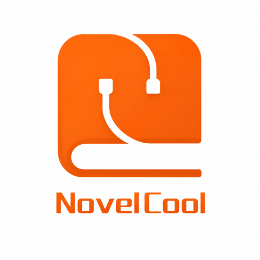

  

  
  
  

  

  

  On iPhone or iPad, tap the button that matches your Paperback version. 
  The <a href="https://poppingmangosources.github.io/popmango-paperback-sources/all/"><b>combined source directory</b></a> lets you browse and search both catalogs together.

---

## About

**PoppingMango Sources** is an independent source collection for [Paperback](https://paperback.moe), covering novels, manga, manhwa, and manhua. This repository contains the Paperback 0.8 compatibility ports and publishes the combined directory for both the 0.8 and 0.9 catalogs.

Paperback 0.8 and 0.9 use different extension APIs. Install the repository that matches your app; the 0.8 sources here are rebuilt for Paperback 0.8 rather than repackaged 0.9 bundles.

## Paperback 0.9 Sources

The full current catalog is maintained in [`general-extensions-mangago`](https://github.com/PoppingMangoSources/general-extensions-mangago/tree/0.9/test).

<!-- sources-09:start -->

**28 sources available for Paperback 0.9.**

| Source | Site |
| :----- | :--- |
|  **BunManga** | [bunmanga.com](https://bunmanga.com) |
|  **Chikari** | [chikari.moe](https://chikari.moe) |
|  **Cocomic** | [cocomic.co](https://cocomic.co) |
|  **Galaxy Manga** | [galaxymanga.io](https://galaxymanga.io) |
|  **KaliScan** | [kaliscan.com](https://kaliscan.com) |
|  **KingOfShojo** | [kingofshojo.com](https://kingofshojo.com) |
|  **LikeManga** | [likemanga.ink](https://likemanga.ink) |
|  **Lua Comic** | [luacomic.org](https://luacomic.org) |
|  **MangaBerri** | [mangaberri.com](https://mangaberri.com) |
|  **MangaCherri** | [mangacherri.com](https://mangacherri.com) |
|  **MangaHere** | [mangahere.cc](https://mangahere.cc) |
|  **MangaHome** | [mangahome.com](https://mangahome.com) |
|  **MangaTown** | [mangatown.com](https://mangatown.com) |
|  **MVLEMPYR** | [mvlempyr.io](https://mvlempyr.io) |
|  **MyReadingManga** | [myreadingmanga.info](https://myreadingmanga.info) |
|  **NovelArchive** | [novelarchive.cc](https://novelarchive.cc) |
|  **NovelCool** | [novelcool.com](https://novelcool.com) |
|  **oManga** | [omanga.to](https://omanga.to) |
|  **Ranobes** | [ranobes.net](https://ranobes.net) |
|  **ReiManga** | [reimanga.net](https://reimanga.net) |
|  **RinkoComics** | [rinkocomics.com](https://rinkocomics.com) |
|  **RokariComics** | [rokaricomics.com](https://rokaricomics.com) |
|  **Scans.GG** | [scans.gg](https://scans.gg) |
|  **StoneScape** | [stonescape.xyz](https://stonescape.xyz) |
|  **Temple Scan** | [templetoons.com](https://templetoons.com) |
|  **ValirScans** | [valirscans.org](https://valirscans.org) |
|  **VyManga** | [mangavyvy.net](https://mangavyvy.net) |
|  **XCOMIC** | [xcomic.me](https://xcomic.me) |

<!-- sources-09:end -->

## Paperback 0.8 Sources

These sources have been converted and checked against Paperback 0.8’s available capabilities. More will be added here as each port is completed.

<!-- sources-08:start -->

**4 sources available for Paperback 0.8.**

| Source | Site |
| :----- | :--- |
|  **BunManga** | [bunmanga.com](https://bunmanga.com) |
|  **Cocomic** | [cocomic.co](https://cocomic.co) |
|  **LikeManga** | [likemanga.ink](https://likemanga.ink) |
|  **VyManga** | [mangavyvy.net](https://mangavyvy.net) |

<!-- sources-08:end -->

## Support

  

Source problems are handled in the [**OTHER-REPOS**](https://discord.com/channels/965890377896845352/1367512880228077648) channel of the linked Discord.

  

Include the affected source, the page or title that failed, and screenshots or request details when possible. For a new source suggestion, use the repository’s source-request issue form.

## Development

<b>Build and conversion notes</b>

~~~bash
npm install
npm run typecheck
npm run bundle -- --folder=all
npm run readme -- --folder=all
npm run site -- --folder=all
npm test
~~~

Pushing <code>main</code> publishes the combined directory at <code>/all</code>. The previous <code>/0.8</code> path remains available so existing Paperback 0.8 installs keep receiving updates.

The [conversion guide](docs/CONVERSION.md) documents the 0.9-to-0.8 capability map. The shared runtime in <code>common/</code> implements the Paperback 0.8 interfaces used by the converted sources.

## Disclaimer

These extensions are **not** affiliated with Paperback or any supported website. All site names and logos belong to their respective owners.

[GNU General Public License v3.0 or later](LICENSE).
